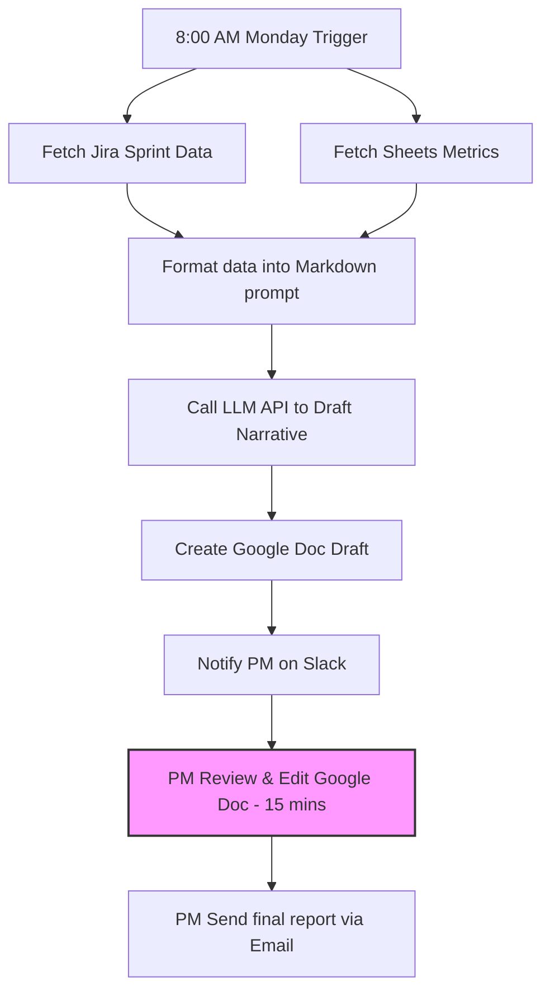

# Ví dụ bản nộp — Weekly Report trước và sau AI

> Ví dụ này cho thấy một bài nộp Day 02 hoàn chỉnh trông như thế nào. Không copy nội dung ví dụ; hãy học cách đi từ problem scan → workflow → research → Problem Statement → Rule / Workflow / Agent → quyết định cuối.

Case ví dụ: **Tổng hợp weekly report**

Nhân vật ví dụ: Minh, Junior Product Manager tại một công ty SaaS khoảng 50 người. Mỗi tuần Minh phải tổng hợp số liệu từ Jira, Google Sheets và Slack để viết báo cáo tuần cho Engineering Manager và CEO.

## Vì sao đây là ví dụ tốt?

- Có actor cụ thể.
- Có workflow lặp lại hằng tuần.
- Có bottleneck rõ.
- Có metric thời gian.
- Có thể so sánh Rule / Workflow / Agent.
- Có thể vẽ before/after workflow.

---

# 01 — Individual Problem Scan

## Scan rộng

Minh scan 10 problems, vượt mức tối thiểu 5.

| # | Lăng kính | Problem quan sát được | Ai đang đau? | Dấu hiệu thật |
|---|---|---|---|---|
| 1 | Lặp lại | Mỗi thứ Hai tổng hợp Weekly Report từ Jira, Sheets, Slack | PM, EM, CEO | Mất khoảng 90 phút/tuần |
| 2 | Lặp lại | Copy sprint velocity từ Jira vào slide update | PM | Lặp lại mỗi tuần |
| 3 | Tốn thời gian | Review PRD 10-15 trang trước khi comment | PM reviewer, design lead | 45 phút/bản |
| 4 | Tốn thời gian | Viết meeting notes sau cross-team meeting | PM, team member | 30 phút/buổi |
| 5 | AI có thể tốt hơn | Notion không gợi ý priority theo deadline/context | PM, team member | Task nhiều nhưng priority mơ hồ |
| 6 | AI có thể tốt hơn | Slack search tìm decision cũ rất khó | Cả team | 10-15 phút/lần tìm |
| 7 | Pain từ người khác | Designer phải hỏi lại vì spec từ PM mập mờ | Designer, PM | Hỏi lại 2-3 lần/spec |
| 8 | Pain từ người khác | CEO hỏi update nhưng report chưa sẵn | CEO, PM | Hay bị trễ deadline thứ Hai |
| 9 | Tốn thời gian | Tổng hợp monthly KPI từ nhiều dashboard | PM, manager | Lặp lại mỗi tháng |
| 10 | Lặp lại | Viết standup update mỗi sáng cùng format | PM | 5-10 phút/ngày |

Vì sao phần scan này mạnh:

- Có scan rộng trước khi hội tụ.
- Có nhiều lăng kính khác nhau.
- Mỗi problem có actor và dấu hiệu thật.
- Không bắt đầu bằng "làm chatbot" hoặc "xây agent".

## Top 3

| Rank | Problem | Vì sao chọn | Điều còn chưa chắc |
|---|---|---|---|
| 1 | Weekly Report | Workflow rõ, mất nhiều thời gian, có metric tốt | Narrative "đủ tốt" đo thế nào |
| 2 | Review PRD | Có pain thật, AI có thể giúp đọc/tóm tắt | Quality improvement khó đo |
| 3 | Slack Search | Nhiều người đau, impact rộng | Data access khó, scope có thể quá lớn |

## Problem Card #1 — Weekly Report

**Problem 1 câu:**  
Mỗi thứ Hai PM mất khoảng 90 phút tổng hợp Weekly Report từ nhiều nguồn, trong đó bước viết narrative tốn nhất và dễ trễ deadline.

**Actor:**  
Junior PM chịu trách nhiệm gửi weekly report cho Engineering Manager và CEO.

**Thời điểm / bối cảnh:**  
Thứ Hai hằng tuần, trước buổi leadership sync.

**Current workflow:**

```text
1. Export Jira sprint data
2. Lấy metrics từ Google Sheets
3. Đọc Slack recap tuần
4. Tổng hợp vào Google Docs
5. Viết narrative: insight, highlight, risk, next action
6. Self-review + format
7. Gửi Stakeholders
```

**Bottleneck:**  
Bước 5 — viết narrative từ raw data mất khoảng 25 phút và hay bị blank page.

**Impact:**  
90 phút/tuần cho 1 PM. Team có 3 PM nên tổng công sức có thể khoảng 270 phút/tuần. Báo cáo trễ làm leadership thiếu bối cảnh trước buổi sync.

**Success metric:**  
Giảm tổng thời gian từ 90 phút xuống dưới 30 phút, không tăng số câu CEO/EM phải hỏi lại.

**Non-AI alternative:**  
Template report + Jira dashboard + checklist có thể giảm format effort, nhưng chưa giải quyết tốt phần viết narrative.

**AI hypothesis:**  
AI hỗ trợ cấu trúc dữ liệu và draft narrative. PM vẫn review/edit trước khi gửi.

**Quick gut:**  
Workflow.

### Draft current workflow

```text
CURRENT STATE — 90 phút

[1 Export Jira: 10']
→ [2 Lấy metrics: 10']
→ [3 Đọc Slack: 15']
→ [4 Tổng hợp vào Docs: 15']
→ [5 Viết narrative: 25']  <-- bottleneck
→ [6 Review + format: 10']
→ [7 Gửi: 5']
```

### Draft future workflow

```text
FUTURE STATE — 21 phút

[1 Auto-pull data: 2']
→ [2 AI cấu trúc dữ liệu: 1']
→ [3 AI draft narrative: 1']
→ [4 PM review + edit: 15']  <-- human boundary
→ [5 PM gửi: 2']

Fallback: AI draft tệ → PM tự viết lại.
```

## Problem Cards #2 và #3 — tóm tắt

| Card | Actor | Bottleneck | Metric | Quick gut | Vì sao chưa chọn làm #1 |
|---|---|---|---|---|---|
| Review PRD | PM reviewer | Đọc 10-15 trang để hiểu context | 45 phút → 20 phút | Workflow | Quality metric khó hơn |
| Slack Search | Team member | Search keyword rồi đọc thread | 15 phút → dưới 2 phút | Agent / Workflow | Data access và scope rộng |

---

# 02 — Group Problem Statement

## Group convergence

Nhóm 3-4 người, mỗi người share top 3. Tổng cộng khoảng 9-12 candidates.

| Cluster | Candidate examples | Pattern chung |
|---|---|---|
| Báo cáo / tổng hợp thông tin | Weekly Report, meeting recap, lab progress summary | Gom thông tin từ nhiều nguồn rồi viết lại cho người khác đọc |
| Tìm kiếm / hỏi đáp tài liệu | Slack Search, LMS Search, FAQ lab | Tìm đúng thông tin trong nhiều nguồn rời rạc |
| Review / feedback | Review PRD, check Problem Statement, review assignment | Đọc bản nháp và chỉ ra thiếu sót |
| Planning / follow-up | Action item tracking, deadline reminder | Sau cuộc họp/lab có nhiều việc bị rơi |

## Shortlist và score

| Candidate | Actor rõ | Workflow rõ | Pain có evidence | Impact đo được | Làm được ngay | Tổng |
|---|---|---|---|---|---|---|
| Weekly Report | 5/5 | 5/5 | 4/5 | 5/5 | 4/5 | 23/25 |
| LMS FAQ | 4/5 | 4/5 | 5/5 | 3/5 | 4/5 | 20/25 |
| Meeting recap | 5/5 | 5/5 | 3/5 | 3/5 | 5/5 | 21/25 |

*Quyết định của nhóm:* Chọn **Weekly Report** vì có workflow rõ nhất và bottleneck hiển nhiên.

## Validation & Research

### Khảo sát nhanh (Validation)
Nhóm phỏng vấn EM và CEO:
- CEO: "Tôi không cần report quá dài, chỉ cần 3 dòng: Cái gì đã xong, cái gì đang nghẽn, tuần tới làm gì."
- EM: "Tôi cần link Jira để verify nếu cần, và muốn PM chỉ rõ nếu dev team đang bị overcommit."

### Nghiên cứu giải pháp (Research)
Nhóm tìm hiểu:
1. Jira Automation: Có thể tự gửi email digest nhưng chỉ là list ticket, thiếu narrative phân tích.
2. Slack AI: Có tính năng tóm tắt kênh nhưng không gom được dữ liệu Jira và Sheets.
3. Giải pháp đề xuất: Xây dựng workflow sử dụng LLM API kết nối Jira API và Google Sheets API (hoặc dùng Make.com) để gom data → LLM viết nháp báo cáo → PM review và edit.

## Problem Statement v1

> **Cho** Junior Product Manager tại công ty SaaS 50 người, người đang gặp khó khăn trong việc tổng hợp dữ liệu rời rạc và viết narrative cho báo cáo tuần vào mỗi sáng thứ Hai, **đo bằng** việc mất 90 phút hằng tuần và dễ bị trễ deadline họp sync. **Chúng tôi sẽ giải quyết bằng cách** xây dựng một workflow tự động gom dữ liệu (Jira, Sheets, Slack) và dùng AI tạo bản thảo narrative ban đầu để PM tinh chỉnh, **giúp cải thiện** thời gian hoàn thành báo cáo tuần xuống dưới 30 phút, **đảm bảo** báo cáo luôn sẵn sàng trước 9:00 sáng thứ Hai với độ chính xác và chất lượng narrative được stakeholders (CEO, EM) chấp nhận.

---

# 03 — Solution Design

## Rule / Workflow / Agent?

Nhóm so sánh 3 phương án:

1. **Rule-based**: Dùng Jira dashboard. (Không giải quyết được bước viết narrative).
2. **Workflow**: Một kịch bản định sẵn (ví dụ trên Make.com hoặc kịch bản Python). Trigger vào 8:00 sáng thứ Hai → Pull data từ Jira/Sheets → Gửi prompt tới LLM → Tạo bản nháp Google Docs → PM vào sửa.
3. **Agent**: Một chatbot chạy ngầm tự chủ động nhắn tin hỏi từng dev xem tuần qua làm gì để tự viết báo cáo. (Quá phức tạp, nguy cơ làm phiền dev cao, bảo mật thông tin khó kiểm soát).

*Quyết định:* Chọn phương án **Workflow** vì quy trình mang tính tuyến tính, đầu vào và đầu ra xác định, cần độ tin cậy cao và chi phí phát triển thấp.

## Workflow chi tiết (Nhóm tự vẽ)

*(Xem file `02-group-problem-statement-workflow.pdf` hoặc code Mermaid dưới đây)*



## Ranh giới (Boundary) & Fallback

- **Boundary**: AI tuyệt đối không tự động gửi email cho CEO/EM. Bắt buộc phải qua bước PM duyệt và nhấn nút gửi. AI không được tự ý bịa ra số liệu Jira (số liệu thô phải được render trực tiếp từ API, LLM chỉ được viết phần nhận xét).
- **Fallback**: Nếu API Jira lỗi hoặc LLM không phản hồi, hệ thống sẽ gửi thông báo Slack: *"Hệ thống tự động lỗi. Vui lòng sử dụng template backup tại docs.google.com/... và tự viết thủ công."* PM sẽ quay lại workflow cũ.

---

# 04 — Quyết định Cuối cùng (Go/Not Yet/No-Go)

**Quyết định: GO.**

**Lý do:**
1. Rõ ràng về actor và workflow.
2. Bottleneck (viết narrative) chiếm 30% thời gian nhưng chiếm 80% độ trì hoãn. AI giải quyết rất tốt phần này.
3. Ranh giới an toàn dễ thiết lập (PM duyệt trước khi gửi).
4. Công cụ Make.com + LLM API đủ rẻ và dễ làm, có thể hoàn thành MVP trong 3 ngày.

**Kế hoạch tiếp theo:**
- Nhóm phân công Minh xây dựng workflow trên Make.com.
- Hoàng chuẩn bị prompt template cho LLM.
- Thử nghiệm chạy song song (shadow testing) vào thứ Hai tuần tới.
