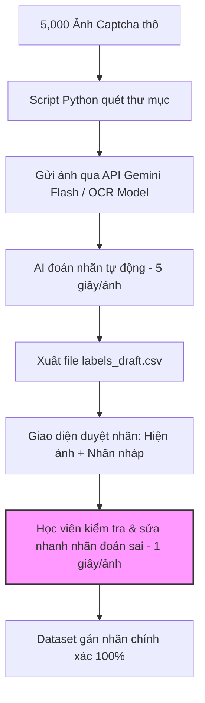

# 02 — Group Problem Statement (Bài làm nhóm)

*Thành viên nhóm:*
1. [Học viên - Họ và Tên - Mã Học Viên]
2. Lâm (AI đóng vai: Lâm - Data Analyst/Engineer)

---

## 1. Nhật ký hội tụ (Group Convergence)

*Ghi lại quá trình gom cụm các vấn đề của các thành viên và lý do chọn vấn đề chung.*

### Các cụm vấn đề chính (Clusters)
- **Cụm 1: Hỗ trợ vận hành & nộp bài Lab hàng ngày** - Gồm vấn đề dọn dẹp môi trường nộp bài của học viên và vấn đề phân tích logs lỗi pipeline dữ liệu của Lâm.
- **Cụm 2: Tối ưu hóa quy trình R&D / Huấn luyện mô hình AI** - Gồm vấn đề gán nhãn (labeling) Captcha, thiết bị local yếu không train được lâu của học viên và tự động hóa viết Data Dictionary của Lâm.

### Đánh giá các ứng viên tiềm năng (Shortlist & Score)

| Candidate | Đối tượng rõ (1-5) | Quy trình rõ (1-5) | Bằng chứng đau (1-5) | Đo lường được (1-5) | Khả thi làm ngay (1-5) | Tổng điểm |
|---|---|---|---|---|---|---|
| **1. Dọn dẹp môi trường nộp bài** | 5/5 | 5/5 | 4/5 | 5/5 | 5/5 | **24/25** |
| **2. Tự động gán nhãn Captcha** | 5/5 | 5/5 | 5/5 | 5/5 | 4/5 | **24/25** |
| **3. Phân tích logs lỗi pipeline** | 4/5 | 4/5 | 4/5 | 4/5 | 4/5 | **20/25** |

*Quyết định cuối cùng của nhóm:* Mặc dù ứng viên 1 có điểm khả thi rất cao, nhóm nhận thấy vấn đề này có thể giải quyết tốt bằng script tự động hóa thông thường (Rule-based) mà không cần AI. Do đó, nhóm thống nhất chọn **Ứng viên 2: Tự động gán nhãn (pre-labeling) Captcha** vì đây là nỗi đau rất lớn trong nghiên cứu AI, tốn hàng chục giờ gõ tay và cực kỳ phù hợp để giải quyết bằng AI Workflow (Human-in-the-loop).

---

## 2. Kiểm chứng nhanh & Nghiên cứu giải pháp (Validation & Research)

### Bằng chứng kiểm chứng thực tế (Validation Evidence)
- **Khảo sát thực tế:** Học viên nghiên cứu Captcha tại UNETI cần chuẩn bị tập dữ liệu tối thiểu 5,000 ảnh Captcha đã được gán nhãn để huấn luyện mô hình OCR đạt độ chính xác ổn định (> 90%).
- **Metric hiện tại:** Với tốc độ gõ tay trung bình 15 giây/ảnh (nhìn ảnh Captcha méo mó, gõ chữ tương ứng và lưu), một người phải mất hơn **20 giờ làm việc liên tục** chỉ để gán nhãn xong 5,000 ảnh.
- **Tỷ lệ lỗi:** Do tính chất tẻ nhạt và mệt mỏi, tỷ lệ gõ sai nhãn do con người (human error) dao động từ **5% đến 8%**, ảnh hưởng trực tiếp đến chất lượng huấn luyện mô hình AI sau đó.

### Nghiên cứu giải pháp hiện có (Research)
1. **Dùng thư viện OCR truyền thống (Tesseract OCR):** Thử nghiệm nhanh cho thấy độ chính xác đối với Captcha UNETI (chữ bị xoay, méo và có đường kẻ đè chéo) chỉ đạt chưa đầy **10%**, hoàn toàn không thể dùng làm nhãn nháp.
2. **Dịch vụ giải Captcha (2Captcha, Anti-Captcha):** Chi phí khoảng $1 - $3 cho 1,000 lượt giải. Để gán nhãn 5,000 ảnh tốn khoảng $5 - $15. Mặc dù khả thi nhưng tốn kém đối với sinh viên và không chủ động được dữ liệu.
3. **Giải pháp AI đề xuất:** Sử dụng một mô hình nhận diện Captcha đã được train sơ bộ (hoặc gọi API của mô hình đa phương tiện như Gemini Flash qua prompt hướng dẫn nhận diện ký tự trong ảnh) để **tự động gán nhãn nháp (pre-label)**, xuất ra file CSV. Học viên chỉ cần mở file Excel hoặc một giao diện web đơn giản để duyệt nhanh và sửa những nhãn bị đoán sai.

---

## 3. Problem Statement v1

> **Cho** học viên nghiên cứu AI tại UNETI, người đang gặp khó khăn trong việc gán nhãn thủ công hàng ngàn ảnh Captcha thô cho tập dữ liệu train mô hình OCR, **đo bằng** việc mất 20 tiếng gõ tay cho 5,000 ảnh và tỷ lệ lỗi gõ sai do mệt mỏi từ 5-8%, **chúng tôi sẽ giải quyết bằng cách** xây dựng một workflow tự động gán nhãn nháp (pre-labeling) bằng mô hình AI (OCR/Gemini API) kết hợp giao diện duyệt lỗi nhanh (human-in-the-loop), **giúp cải thiện** thời gian gán nhãn xuống dưới 2 tiếng cho 5,000 ảnh (bao gồm cả thời gian AI chạy và người duyệt), **đảm bảo** độ chính xác của nhãn sau khi duyệt đạt 100% trước khi đưa vào huấn luyện mô hình.

---

## 4. Thiết kế giải pháp (Solution Design)

### Rule / Workflow / Agent?
- **Rule-based (Không dùng AI):** Dùng các thuật toán xử lý ảnh truyền thống (như tách ngưỡng màu, phân đoạn ký tự). Do Captcha UNETI có chữ bị méo mó, đè nhau và dính nét nên giải pháp rule-based thất bại hoàn toàn trong việc nhận diện.
- **Workflow (AI-in-the-loop):** AI đóng vai trò nhận diện nháp (pre-label) các ảnh Captcha hàng loạt và lưu vào file nhãn tạm thời. Con người đóng vai trò kiểm duyệt và chỉnh sửa những nhãn AI đoán sai thông qua giao diện duyệt lỗi trực quan. Giải pháp này giúp giảm 90% khối lượng công việc nhập liệu mà vẫn đảm bảo nhãn chính xác tuyệt đối.
- **Agent (Tự chủ hoàn toàn):** Một Agent tự động crawl ảnh, tự gán nhãn và tự cập nhật tập train cho mô hình mà không cần con người. Hướng đi này không khả thi vì nếu Agent đoán sai, dữ liệu sai (data poisoning) sẽ làm hỏng mô hình OCR thế hệ tiếp theo.

*Quyết định của nhóm:* Chọn **Workflow (AI-in-the-loop)** để tối ưu giữa công sức của con người và độ chính xác của dữ liệu.

### Sơ đồ Workflow chi tiết (Trước/Sau)

#### Workflow hiện tại (Current State) — Mất 20 giờ
```text
[5,000 Ảnh Captcha thô]
→ [Học viên nhìn ảnh và gõ tay từng ký tự: 15 giây/ảnh] (Bottleneck - mệt mỏi, dễ sai sót)
→ [Dataset gán nhãn hoàn chỉnh]
```

#### Workflow đề xuất có AI (Future State - Mermaid Diagram)


### Ranh giới an toàn (Boundary) & Phương án dự phòng (Fallback)
- **Ranh giới (Boundary):** 
  - AI chỉ được phép gán nhãn nháp (pre-label). 
  - Tuyệt đối không được đưa trực tiếp nhãn do AI đoán vào tập dữ liệu huấn luyện chính thức nếu chưa có sự xác nhận/chỉnh sửa của học viên (con người nắm quyền quyết định cuối cùng).
- **Phương án dự phòng (Fallback):** 
  - Nếu API Gemini gặp lỗi hoặc hết quota, script sẽ tự động chuyển sang gọi mô hình OCR local (mặc dù độ chính xác thấp hơn nhưng vẫn giúp tạo nhãn nháp tốt hơn là gõ trắng hoàn toàn).
  - Nếu toàn bộ hệ thống AI lỗi, học viên sẽ quay lại quy trình gán nhãn thủ công truyền thống.

---

## 5. Quyết định cuối cùng (Go / Not Yet / No-Go)

**Quyết định: GO.**

**Lý do & Điều kiện đi tiếp:**
1. **Bài toán rõ ràng, nỗi đau thực tế:** Tiết kiệm từ 20 giờ gõ tay xuống chỉ còn khoảng 1.5 giờ duyệt nhãn.
2. **Chi phí phát triển cực thấp:** Chỉ cần viết một script Python ngắn để tương tác API và một giao diện Streamlit/Gradio tối giản trong vòng 1-2 ngày.
3. **An toàn dữ liệu:** Quy trình có ranh giới (boundary) rõ ràng, dữ liệu huấn luyện cuối luôn đạt 100% độ chính xác do con người kiểm soát.
