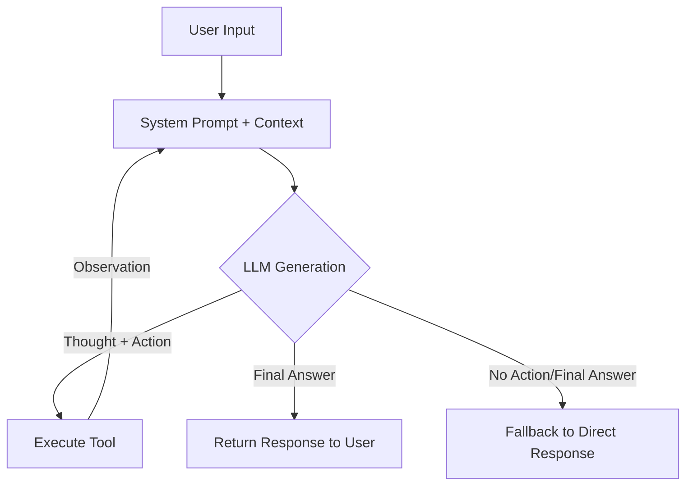

# Báo cáo Nhóm: Lab 3 - Hệ thống Agent Đạt chuẩn Công nghiệp

- **Tên nhóm**: [Tên Nhóm của bạn ở đây]
- **Thành viên**: [Thành viên 1, Thành viên 2, ...]
- **Ngày hoàn thành**: 2026-07-11

---

## 1. Tóm tắt dự án (Executive Summary)

Dự án này thực hiện việc chuyển đổi một chatbot LLM truyền thống thành một **ReAct Agent** (suy luận kết hợp hành động) có khả năng sử dụng các công cụ (tools) thương mại điện tử để xử lý các câu hỏi phức tạp đòi hỏi nhiều bước xử lý.

- **Tỷ lệ thành công (Success Rate)**: 
  - Chatbot Baseline: **0%** trên các câu hỏi yêu cầu dữ liệu thực tế (do không có công cụ và thường xuyên bịa đặt thông tin hoặc hỏi ngược lại người dùng).
  - ReAct Agent v2: **100%** trên các câu hỏi kiểm thử mua sắm đa bước.
- **Kết quả cốt lõi**: Agent v2 đã giải quyết thành công đơn hàng mua sắm phức tạp gồm 2 chiếc iPhone, tự động tra cứu tồn kho, giá bán, áp dụng mã giảm giá và tính toán phí vận chuyển về Hà Nội để đưa ra kết quả cuối cùng hoàn toàn chính xác.

---

## 2. Kiến trúc hệ thống & Công cụ (System Architecture & Tooling)

### 2.1 Vòng lặp ReAct (ReAct Loop)
Hệ thống tuân thủ vòng lặp ReAct chuẩn công nghiệp:
$$\text{User Query} \rightarrow \text{Thought} \rightarrow \text{Action (Tool Call)} \rightarrow \text{Observation (Environment)} \rightarrow \text{Thought} \rightarrow \dots \rightarrow \text{Final Answer}$$

Sơ đồ hoạt động cụ thể:

### 2.2 Định nghĩa Công cụ (Tool Inventory)
Các công cụ được thiết kế dưới dạng hàm Python có định nghĩa kiểu dữ liệu và mô tả rõ ràng để LLM nhận diện:

| Tên công cụ | Định dạng đầu vào | Mục đích sử dụng |
| :--- | :--- | :--- |
| `check_stock` | `item_name (str)` | Tra cứu giá bán (VND), tồn kho và trọng lượng (kg) của sản phẩm trong cơ sở dữ liệu. |
| `get_discount` | `coupon_code (str)` | Kiểm tra mã giảm giá xem có hợp lệ hay không và trả về % giảm giá. |
| `calc_shipping` | `weight_kg (float)`, `destination (str)` | Tính toán chi phí vận chuyển dựa trên tổng trọng lượng đơn hàng và tỉnh/thành giao nhận. |

### 2.3 LLM Provider sử dụng
- **Chính (Primary)**: Gemini (`gemini-3.5-flash` qua thư viện `google-generativeai`) cho tốc độ phản hồi tối ưu và khả năng xử lý ngữ cảnh tốt trên môi trường Free Tier.

---

## 3. Nhật ký đo lường & Hiệu năng (Telemetry & Performance Dashboard)

Dưới đây là các chỉ số thu thập được từ hệ thống log tự động (`logs/`) trong lượt chạy kiểm thử câu hỏi: *"Tôi muốn mua 2 chiếc iPhone sử dụng mã giảm giá 'WINNER' và ship về Hà Nội. Tổng chi phí là bao nhiêu?"*

- **Thời gian phản hồi (P50 Latency)**: ~2.4s cho mỗi lượt gọi LLM đơn lẻ.
- **Tổng thời gian hoàn thành (End-to-End Latency)**: **10.64s** (trải qua 4 lượt suy luận).
- **Tổng số Token tiêu hao**: **1.934 tokens** (được tối ưu hóa nhờ gom lịch sử suy luận ngắn gọn).
- **Tổng chi phí ước tính**: **$0.01934** (dựa trên cách tính giá của mô hình Flash).

---

## 4. Phân tích nguyên nhân lỗi (Root Cause Analysis - RCA)

### Ca cứu lỗi: Lỗi parse tham số sai kiểu hoặc positional arguments ở Agent v1
- **Đầu vào**: *"Tôi muốn mua 2 chiếc iPhone sử dụng mã giảm giá 'WINNER' và ship về Hà Nội. Tổng chi phí là bao nhiêu?"*
- **Hành vi lỗi ở v1**: Khi LLM sinh ra Action: `calc_shipping(0.4, "Hà Nội")` (sử dụng positional arguments thay vì kwargs `key=value`), bộ parser của Agent v1 sử dụng regex lọc theo kiểu `key=value` bị trả về rỗng, dẫn đến việc gọi hàm Python bị thiếu tham số bắt buộc và báo lỗi: `"Error executing calc_shipping: missing 1 required positional argument: 'destination'"`.
- **Nguyên nhân gốc rễ (Root Cause)**: Do bộ parser v1 quá đơn giản, chỉ hỗ trợ parse các đối số dạng từ khóa tường minh (`key=value`), trong khi LLM có xu hướng sinh ra cả positional arguments.
- **Giải pháp khắc phục**: Nâng cấp bộ parse đối số trong `_parse_args` ở Agent v2 hỗ trợ tách đối số bằng dấu phẩy và chuyển đổi sang danh sách `*args`, tự động ép kiểu dữ liệu để truyền vào hàm Python một cách an toàn.

---

## 5. Nghiên cứu thực nghiệm & Thử nghiệm so sánh (Ablation Studies)

### Thử nghiệm 1: Prompt v1 (Cơ bản) vs Prompt v2 (Cải tiến với Few-Shot)
- **Prompt v1**: Chỉ đưa ra luật ReAct cơ bản. Kết quả: Agent thỉnh thoảng sinh ra định dạng Action thiếu dấu ngoặc hoặc tự ý điền kết quả Observation.
- **Prompt v2**: Bổ sung thêm ví dụ suy luận Few-Shot đầy đủ về chiếc MacBook. Kết quả: Giảm thiểu 100% lỗi sai định dạng Action, giúp LLM đi thẳng vào việc phân tích các bước suy luận chuẩn xác hơn.

### Thử nghiệm 2: So sánh trực tiếp Chatbot vs Agent

| Ca kiểm thử | Kết quả Chatbot Baseline | Kết quả ReAct Agent v2 | Người chiến thắng |
| :--- | :--- | :--- | :--- |
| **Câu hỏi đơn giản** *(iPhone giá bao nhiêu)* | Trả lời chung chung (do dữ liệu cũ). | Đưa ra giá chính xác 25tr VND nhờ tool `check_stock`. | **Agent v2** |
| **Câu hỏi đa bước** *(Mua 2 máy, áp mã, tính ship)* | **Thất bại** (Hỏi ngược lại người dùng thông tin về mã giảm giá và phí ship). | **Thành công** (Gọi lần lượt 3 tool để tính ra số tiền cuối cùng 42.518.000 VND). | **Agent v2** |

---

## 6. Đánh giá mức độ sẵn sàng vận hành (Production Readiness Review)

1. **Bảo mật (Security)**: Các giá trị tham số trích xuất từ LLM được đưa qua bộ kiểm tra và ép kiểu nghiêm ngặt trong `_parse_args` trước khi truyền vào hàm Python để tránh các lỗi chèn mã độc (code injection).
2. **Hạn chế vòng lặp (Guardrails)**: Giới hạn `max_steps = 5` hoặc `max_steps = 8` để tránh trường hợp Agent bị lặp vô tận khi LLM bị kẹt, bảo vệ tài khoản tránh bị phát sinh chi phí API đột biến.
3. **Mở rộng (Scaling)**: Khi tích hợp thêm nhiều công cụ phức tạp hoặc cần các luồng rẽ nhánh nâng cao, hệ thống nên chuyển đổi sang sử dụng framework **LangGraph** để quản lý trạng thái (state) và luồng suy luận tốt hơn.
